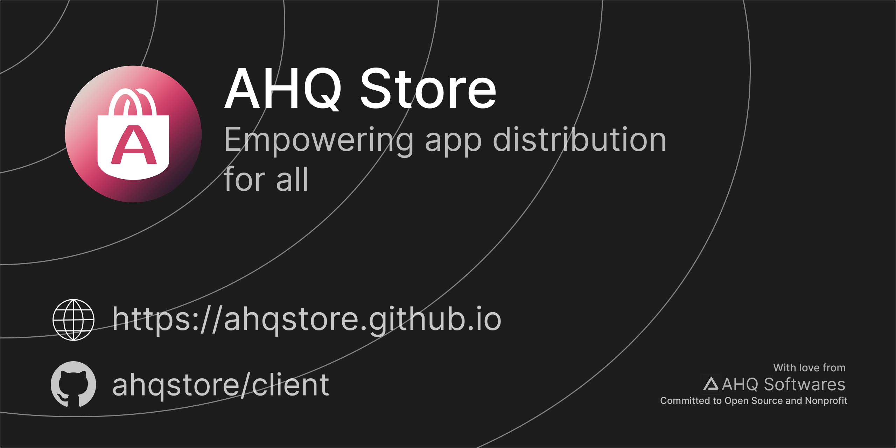

##  The AHQ Store Project
Making app distribution accessible to everyone!
AHQ Store is an open source store client app created by @ahqsoftwares & his non profit org with the sole object to make a free client through which people can distribute their apps

**Store Client:** 
  - **Legacy *(Current)***: https://github.com/ahqsoftwares/tauri-ahq-store
  - ***NEO (in development)***: https://github.com/ahqstore/client

**Upload your app:** https://github.com/ahqstore/apps

**Our site:** https://ahqstore.github.io

<!--

**Here are some ideas to get you started:**

🙋‍♀️ A short introduction - what is your organization all about?
🌈 Contribution guidelines - how can the community get involved?
👩‍💻 Useful resources - where can the community find your docs? Is there anything else the community should know?
🍿 Fun facts - what does your team eat for breakfast?
🧙 Remember, you can do mighty things with the power of [Markdown](https://docs.github.com/github/writing-on-github/getting-started-with-writing-and-formatting-on-github/basic-writing-and-formatting-syntax)
-->
